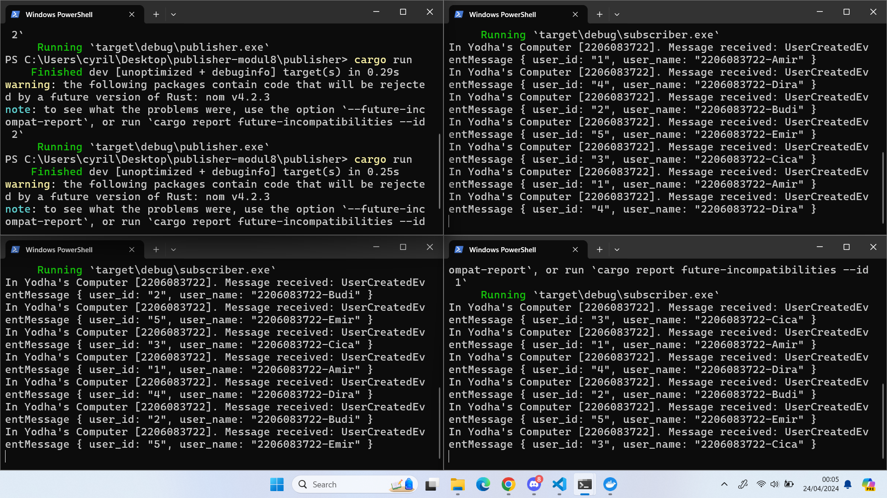
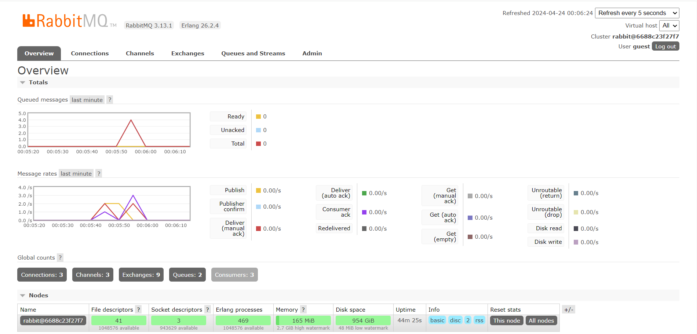

1. What is AMQP?

    AMQP merupakan singkatan dari Advanced Message Queuing Protocol. Protokol AMQP biasanya digunakan untuk mengatur pengiriman pesan antara aplikasi atau sistem yang berbeda, beberapa contoh penggunaan AMQP adalah sistem microservices, sistem terdistribusi,sistem pub/sub, dll.

2. What it means? guest:guest@localhost:5672 , what is the first guest, and what is the second guest, and what is localhost:5672 is for?

    `guest:guest@localhost:5672` menandakan program melakukan koneksi terhadap server AMQP yang berjalan secara lokal. `guest:guest` menandakan username dan password pengguna untuk masuk ke server AMQP. Sementara itu, `localhost` menandakan hostname atau IP address server AMQP berjalan dan `5672` menunjukan port yang digunakan untuk berkomunikasi
  

Pada gambar pertama terlihat setiap instance subscriber menerima pesan yang berbeda-beda dan setiap instance tidak menerima seluruh data yang dikirim oleh publisher. Hal ini terjadi karena ketiga instance subscriber tersebut berjalan secara paralel sehingga data publisher yang sudah diterima oleh satu instance subscriber tidak akan bisa diterima oleh instance subscriber yang lain. Oleh karena itu, pada gambar kedua terliha grafik pada chart queued messages mengalami penurunan yang lebih cepat dibandingkan saat kita hanya menjalankan satu instance subscriber.
